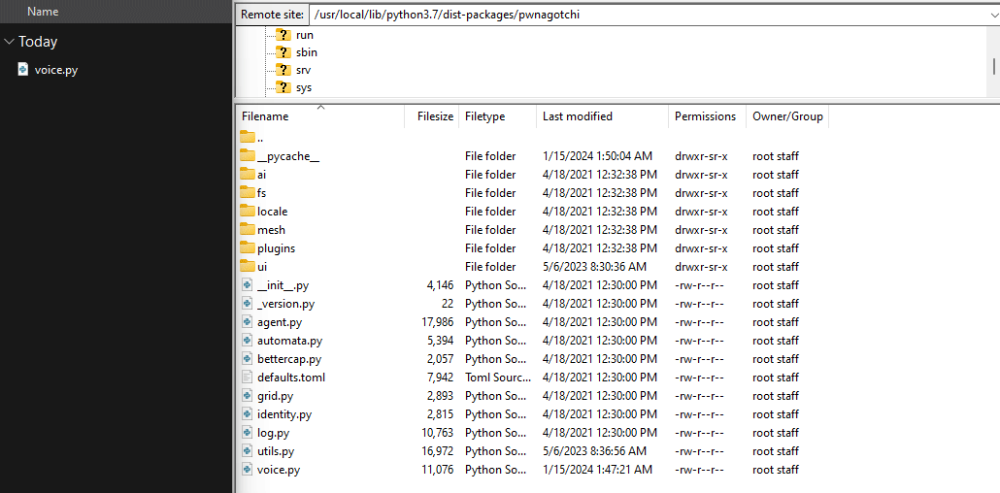
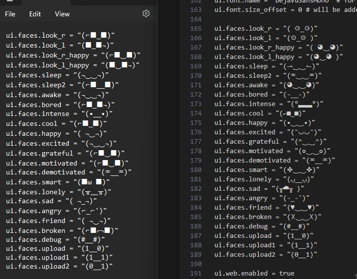

# (˶ᵔ ᵕ ᵔ˶) PwnPersonalities 

Give your Pwnagotchi new unique personalities! Customize voice.py and faces for a personalized touch. (Currently there is only Harold, but I plan on making more soon.)
## Installation

#### 1. Download a personality
You can find screenshots and descriptions in each folder. If you only want to download a specific subfolder, [DownGit](https://minhaskamal.github.io/DownGit/) is helpful.

#### 2. Copy files
Copy and overwrite your chosen `voice.py` to `/usr/local/lib/python3.7/dist-packages/pwnagotchi/` on your pwnagotchi.

I prefer to do this by using FileZilla, and FTPing in. [Tutorial on FTP by WiFiTube](https://www.youtube.com/watch?v=6f7PB3bgaxQ)

#### 3. Edit faces and name in config.toml
If you want custom faces to go with the personality, you need to edit the `config.toml` file in `/etc/pwnagotchi`.

While you're in your config.toml, you can change the main.name (first line of the file) to the character's name if you'd like to.

#### 4. Reboot Pwnagotchi

Click Reboot at the bottom of your WebUI

or:

SSH into your pwnagotchi and run the command `sudo reboot now`

#### 4. Enjoy!
I would advise against looking inside the `voice.py` file, I've tried to add lots of things for each character to say so it never gets boring.

## Screenshots

## Contributing

Contributions are always welcome! Feel free to contribute additional personalities (or suggest changes to current ones) by submitting pull requests. 

